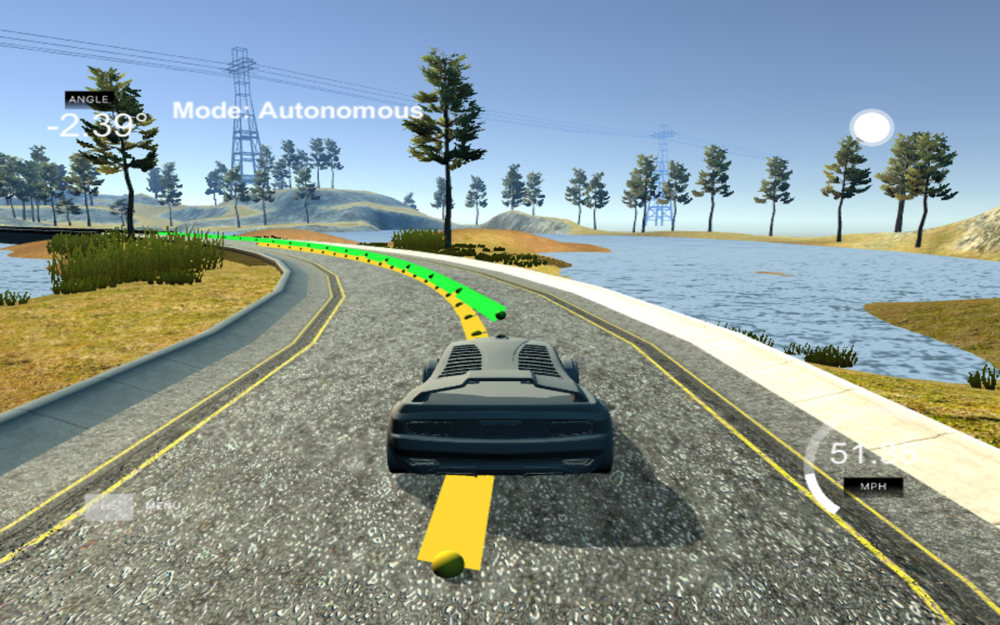
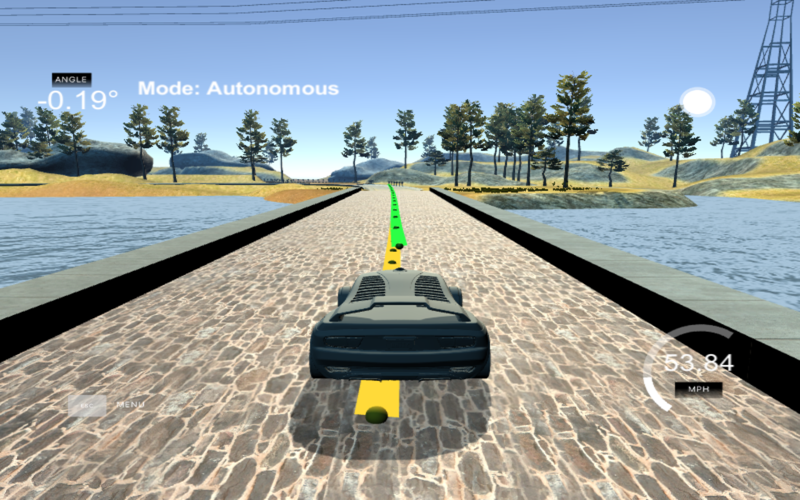

# Model Predictive Control
Self-Driving Car Engineer Nanodegree Program

---

---

---

---

---
## Project description
---

The purpose of this project is to develop a model predictive controller (MPC) to steer a car around a track in a simulator. The simulator provide us feed of value having position of the car, so the weight points are used in order to revieve the optimal cost function and mainly positining of the car on the center lane.
### Project sample GIF


### Project structure 

The main files that are updated here is main.cpp and MPC.cpp
i have' deal with delay yet but soon ill be working on it

The main.cpp file consit of process in which I calculatet steering angle and throtttle using MPC

### Shiftng car angle 

```
Eigen::VectorXd ptsx_vc(ptsx.size());
            Eigen::VectorXd ptsy_vc(ptsx.size());
            for(int i = 0; i < ptsx.size(); i++) {
                ptsx_vc[i] = (ptsx[i] - px) * cos(psi) + (ptsy[i] - py) * sin(psi);
                ptsy_vc[i] = (ptsy[i] - py) * cos(psi) - (ptsx[i] - px) * sin(psi);
            }
       

```
All computations are performed in the vehicle coordinate system. The coordinates of waypoints in vehicle coordinates are obtained by first shifting the origin to the current poistion of the vehicle and a subsequet 2D rotation to align the x-axis with the heading direction. 
In aboce code car angle is shift back to origin suppose we have car on 50 degree so what above code mainly do is bring the car back to orign

this is also called 
###### <i>Polynomial Fitting and MPC Preprocessing</i>

Therby the waypoints are obtained in the frame of the vehicle. A third order polynomial is then fitted to the waypoints. The transformation between coordinate systems is implemented in transformGlobalToLocal. The transformation used is
```
Eigen::VectorXd ptsx_vc(ptsx.size());
Eigen::VectorXd ptsy_vc(ptsx.size());
for(int i = 0; i < ptsx.size(); i++) {
ptsx_vc[i] = (ptsx[i] - px) * cos(psi) + (ptsy[i] - py) * sin(psi);
ptsy_vc[i] = (ptsy[i] - py) * cos(psi) - (ptsx[i] - px) * sin(psi);
}
       
##### MPC Latency
       
Often times, in real life scenario, there will be a few milli seconds delay between the time the command is sent from model and the same got received by CAN Bus for execution, it is called as latency. This latency can affect the performance of our vehicle. For example, if the model predicted the state of the vehicle for next 0.5 seconds, if there is a latency of 0.1 second, then the vehicle would have moved and the prediction will be put to execution at 0.6th second instead of 0.5th second. By that time, the environment could have changed to some extent and model's out doesn't appear to be accurate. So, if there is a latency in the vehicle physicals, it is important to measure that latency and incorporate it in the model itself. In this project, it is indicated that the simulator is having a latency of 100 milli seconds, hence that latency is also incorporated before the actuators values are arrived and sent to vehicle. The code is in main.cpp file at line number 135.
```
Thus the state of the car in the vehicle cordinate system is
```
state << L_x, L_y, L_psi, L_v, L_cte, L_epsi;
          
//      x , y , theta , velocity , cross track error , error psi
```

### Selection of N & dt 
```
size_t N = 20;
double dt = 0.1;
```
Model predits the future state of a vehicle for the next time period. ,It operates as a micro batches of predictions for a small time horizon of few seconds based on the environment & vehicle sensor inputs. In each cycle, the model is executed at regular patch of 'dt' seconds for N times . The model uses  values in iterate and produces a prediction. Having a big N or dt will make the model work faster as number of cycles to be done are lesser. Similarly, having smaller N will make the model to perform much slower.
```
double L_dt = 0.1; // 100 ms
double Lf = 2.67;
double throttle = j[1]["throttle"];
double steering_angle = j[1]["steering_angle"];

double L_x = v * L_dt;
double L_y = 0;
double L_psi = -(v / Lf) * steering_angle * L_dt;
double L_v = v + throttle * L_dt;
double L_cte = cte + v * sin(epsi) * L_dt;

// Compute the expected heading based on coeffs.
double expected_psi = atan(coeffs[1] + 
2.0 * coeffs[2] * latency_x + 
3.0 * coeffs[3] * latency_x*latency_x);

// Compute the latent heading error.
double L_epsi = psi - expected_psi;
```
---

### Reference state

The part of the cost based on the reference state.
```
for (t = 0; t < N; ++t) {
fg[0] += 2000*CppAD::pow(vars[cte_start + t] - ref_cte, 
fg[0] += 1500*CppAD::pow(vars[epsi_start + t] - ref_epsi, 2);
fg[0] += CppAD::pow(vars[v_start + t] - ref_v, 2);
}
```
you can control the above parma mutliplier constants according to the speed requirement 


## Dependencies

* cmake >= 3.5
 * All OSes: [click here for installation instructions](https://cmake.org/install/)
* make >= 4.1(mac, linux), 3.81(Windows)
  * Linux: make is installed by default on most Linux distros
  * Mac: [install Xcode command line tools to get make](https://developer.apple.com/xcode/features/)
  * Windows: [Click here for installation instructions](http://gnuwin32.sourceforge.net/packages/make.htm)
* gcc/g++ >= 5.4
  * Linux: gcc / g++ is installed by default on most Linux distros
  * Mac: same deal as make - [install Xcode command line tools]((https://developer.apple.com/xcode/features/)
  * Windows: recommend using [MinGW](http://www.mingw.org/)
* [uWebSockets](https://github.com/uWebSockets/uWebSockets)
  * Run either `install-mac.sh` or `install-ubuntu.sh`.
  * If you install from source, checkout to commit `e94b6e1`, i.e.
    ```
    git clone https://github.com/uWebSockets/uWebSockets
    cd uWebSockets
    git checkout e94b6e1
    ```
    Some function signatures have changed in v0.14.x. See [this PR](https://github.com/udacity/CarND-MPC-Project/pull/3) for more details.

* **Ipopt and CppAD:** Please refer to [this document](https://github.com/udacity/CarND-MPC-Project/blob/master/install_Ipopt_CppAD.md) for installation instructions.
* [Eigen](http://eigen.tuxfamily.org/index.php?title=Main_Page). This is already part of the repo so you shouldn't have to worry about it.
* Simulator. You can download these from the [releases tab](https://github.com/udacity/self-driving-car-sim/releases).
* Not a dependency but read the [DATA.md](./DATA.md) for a description of the data sent back from the simulator.


## Basic Build Instructions

1. Clone this repo.
2. Make a build directory: `mkdir build && cd build`
3. Compile: `cmake .. && make`
4. Run it: `./mpc`.


 
